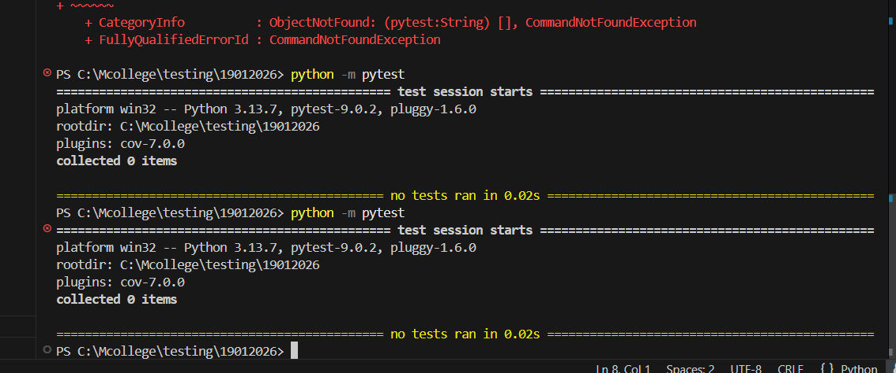

# Завдання білету 13
 У файлі main.py напишіть функцію login(user, password), яка повертає True, якщо пароль дорівнює "admin123", інакше False. Тест: У файлі test.py напишіть тест на успішний логін та тест на невдалий логін.

## Приклад виконання
- запускаємо програму:
  ```bash
  python main.py
  ```
- запускаємо тести:
```bash
python -m unittest -v
```
- результат

