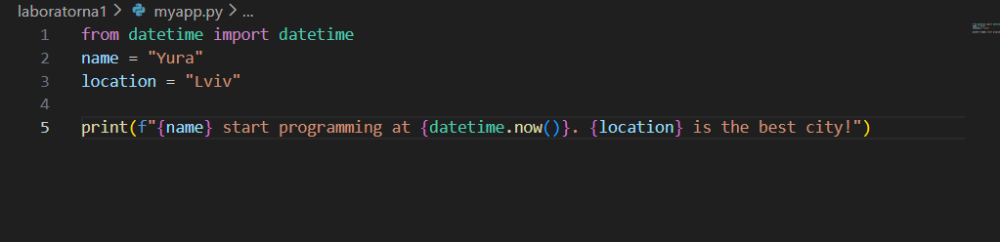

# Звіт до роботи
## Тема: Вступні заняття: налаштування середовища, прочаток роботи з Python та Markdown
### Мета роботи: Налаштувати середовище роботи VS Code, створити репозиторій Github та налаштувати інтеграцію з ним, написати першу програму на Python та створити звіт з використанням форматування Markdown;


---
### Виконання роботи
* Результати виконання завдання *1*;
    1. Розробили/Створили першу програму на Python
    1. Програма вивела значення: Artem start programming at 2025-12-05 15:10:43.036443. Hurtoshitok is the best city!
    1. Отримав наступні результати: Програма працює правильно,код спрацював у всіх методах виклику:<<Terminal,bash,jupyter>> файл з розширенням <<ipynb>> вивів результат.
    1. Навчився налаштуванню середовища роботи VS Code та створювати репозиторії в Github
* вставлені рисунки  
    

* вставлений код / текстовий або числовий результат / інші результати:
    - from datetime import datetime
name = "Yura"
location = "Lviv"
print(f"{name} start programming at {datetime.now()}. {location} is the best city!");

* результати виконання індивідуального завдання (якщо такі є);

---

### Перша програма штучного інтелекту (ChatGPT)

> Запитання: Яку б першу програму написав штучний інтелект та чи міг би він її пояснити?

### Відповідь ChatGPT: Яку першу програму міг би написати ШІ та пояснення до неї

Якби я мав написати свою першу програму, це була б найпростіша та водночас найважливіша програма — **“Hello, World!”**.  
Вона виглядає так (на Python):

```python
print("Hello, World!")
```
### Висновок:
> у висновку відповідаю на запитання:

# ✅ Висновок до роботи

У ході виконання роботи було організовано структуру репозиторію та створено окрему папку для всіх необхідних файлів. Було створено два файли: **my_first_app.py** та **my_first_app.ipynb**, до яких було додано вихідний код програми. У Python-файлі я змінив значення змінних `name` та `location` на власні й успішно запустив програму різними способами, продемонстрованими під час лекції. Результати виконання були додані до звіту у вигляді тексту або скріншоту.

У Jupyter Notebook я створив комірки з кодом та Markdown-комірку з описом у вигляді заголовка. Код був успішно виконаний, а за необхідності — встановлені додаткові бібліотеки. Готовий файл ноутбука було закомічено у репозиторій.

Також я звернувся до ChatGPT із питанням про те, яку першу програму міг би написати штучний інтелект, та отриману відповідь відформатував за допомогою Markdown і додав до звіту. Запропоновану АІ програму я окремо запустив для перевірки — вона виконалася коректно.

### 🎯 Чи досягнуто мети роботи?
Так, мету роботи було повністю досягнуто. Я навчився створювати та запускати Python-файли, працювати з Jupyter Notebook, оформлювати комірки Markdown, а також документувати результати.

### 🧠 Нові знання
- принципи структурування репозиторію;
- робота з різними режимами запуску Python;
- створення та форматування Notebook-комірок;
- взаємодія з Markdown;
- перевірка працездатності стороннього коду (ChatGPT).

### ❓ Чи вдалося відповісти на всі питання?
Так, усі питання, що виникали під час роботи, були опрацьовані та вирішені.

### ✔️ Чи виконано всі завдання?
Так, усі завдання виконані в повному обсязі.

### ⚠️ Чи виникли складності?
Невеликі труднощі виникли лише під час першого запуску Notebook через необхідність встановлення додаткових бібліотек, але вони були швидко усунені.

### 💬 Чи подобається формат здачі?
Так, такий формат є зручним і наочним, оскільки дозволяє поєднувати код, текст, результати та скріншоти в одному документі.

### ⭐ Побажання
Було б корисно додати більше порад щодо роботи з GitHub, а також прикладів найпоширеніших помилок під час запуску інтерпретатора або Notebook, щоб полегшити виконання роботи початківцям.

