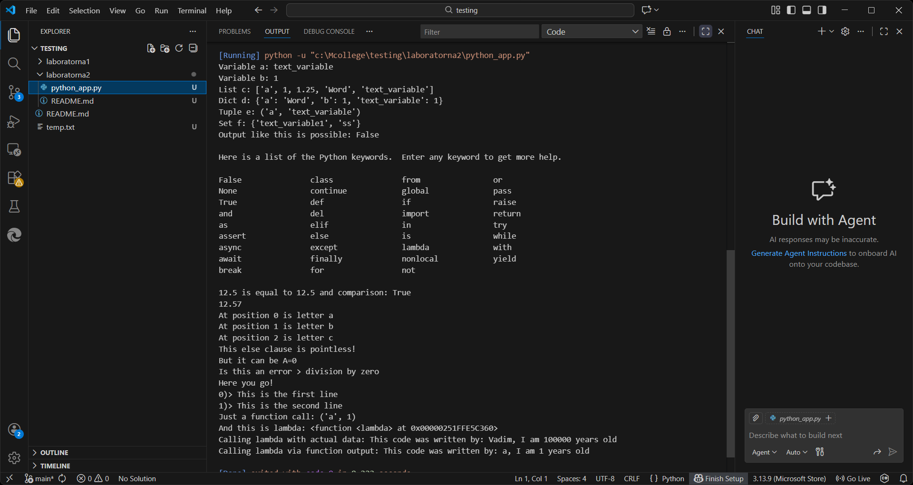

# Звіт до роботи
## Тема: Основи  програмування на Python
### Мета Мета роботи: Навчитись застосовувати основні конструкції мови Python, виконати всі приклади та з використанням AI створити власні приклади які демонструють особливості кодових конструкцій Pyhton


---
### Виконання роботи
* Результати виконання завдання *2*;
    1. Створили код по основам програмування на Python
    1. Програма вивела значення:Variable b: 1
List c: ['a', 1, 1.25, 'Word', 'text_variable']
Dict d: {'a': 'Word', 'b': 1, 'text_variable': 1}
Tuple e: ('a', 'text_variable')
Set f: {'text_variable1', 'ss'}
Output like this is possible: False

    1. Отримав наступні результати: Код працює без помилок,всі поставленні завдання були успішно виконані
    1. Навчився основам програмування на  Python

    

    

* вставлений код / текстовий або числовий результат / інші результати:
    - a = "text_variable"
b = 1
b1 = 1.1
c = ["a", 1, 1.25, "Word", a] 
d = {"a": "Word", "b": 1, a: b} 
e = ("a", a) 
f = {"ss", a + str(b)}  


* результати виконання індивідуального завдання (якщо такі є);

# Основи програмування на Python

У цій лабораторній роботі вивчаються основні конструкції мови Python та практикується їх використання у середовищі Jupyter Notebook.

## 1. Змінні та типи даних
Python підтримує різні типи даних: числа, рядки, списки, словники, множини, кортежі.

```python
# Приклад змінних
text_var = "Hello, Python!"
int_var = 10
float_var = 3.14
list_var = [1, "two", 3.0]
dict_var = {"key1": "value1", "key2": 2}
tuple_var = (1, 2, 3)
set_var = {1, 2, 3}
```
# Висновок

**❓ Що зроблено в роботі:**  
У роботі було вивчено основні конструкції мови Python: змінні, типи даних, списки, словники, множини, кортежі, цикли, розгалуження, обробка виключень, контекст-менеджери та lambda-функції. Було виконано всі запропоновані приклади та створено власні приклади з використанням AI.

**❓ Чи досягнуто мети роботи:**  
Так, мета роботи досягнута. Студент навчився застосовувати базові конструкції Python і створювати власні приклади для практики.

**❓ Які нові знання отримано:**  
- Основи синтаксису Python.  
- Робота з різними типами даних (str, int, float, list, dict, tuple, set).  
- Використання циклів і умовних конструкцій.  
- Обробка помилок через try-except-finally.  
- Робота з контекст-менеджерами (with).  
- Створення та використання lambda-функцій.  
- Використання вбудованих функцій і констант.

**❓ Чи вдалося відповісти на всі питання задані в ході роботи:**  
Так, всі питання та завдання, що були поставлені в лабораторній роботі, виконані та протестовані на прикладах.

**❓ Чи вдалося виконати всі завдання:**  
Так, всі завдання виконано, приклади працюють коректно.

**❓ Чи виникли складності у виконанні завдання:**  
Певні складності були з підбором прикладів для демонстрації lambda-функцій та контекст-менеджерів, але вони були успішно вирішені.

**❓ Чи подобається такий формат здачі роботи (Feedback):**  
Так, формат з готовим Python-кодом та коментарями дозволяє легко перевіряти роботу і зрозуміти логіку виконання.

**❓ Побажання для покращення (Suggestions):**  
- Можна додати більше практичних прикладів з реальними задачами для закріплення знань.  
- Додати невеликі вправи на комбінування декількох конструкцій одночасно.  

